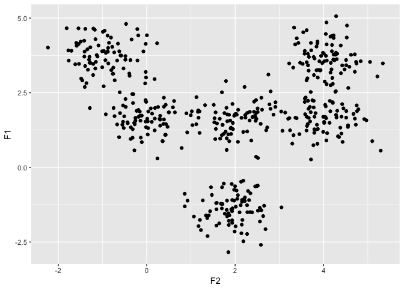
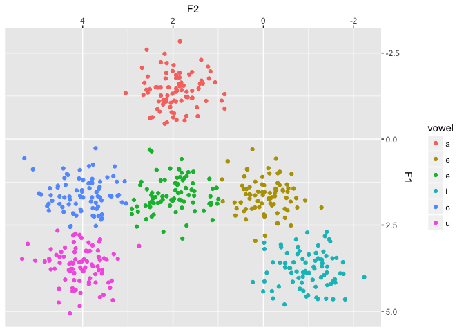
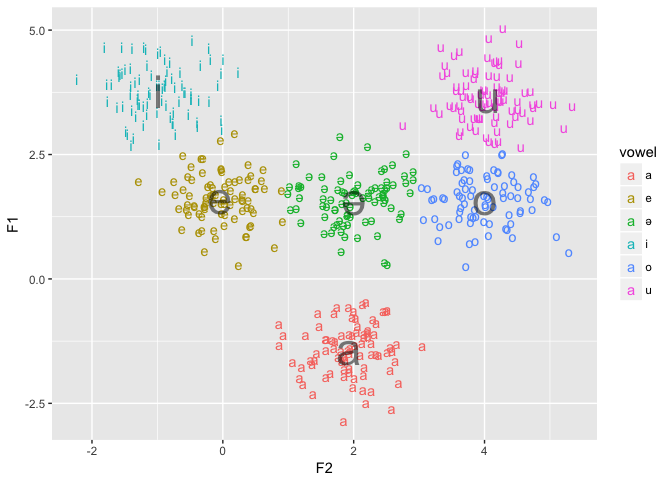
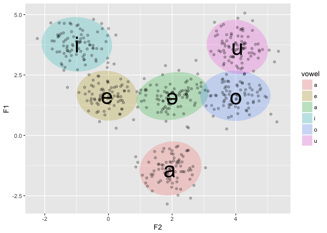
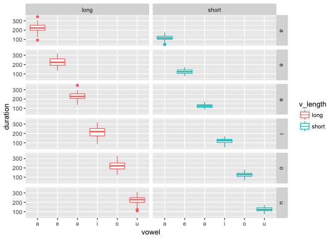
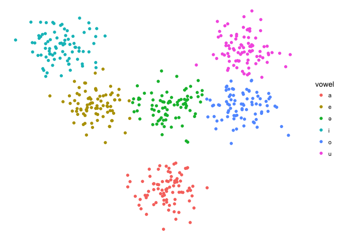
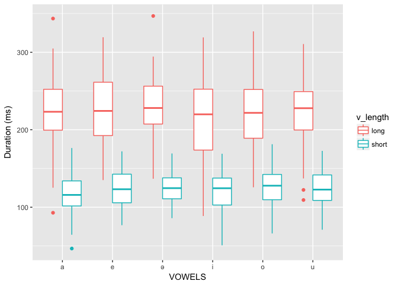

Vowel plots with `ggplot2`
================
Elise Bell
5/17/2019

## Read in data from a CSV

Minimally, your data should have the following columns:

> `[1] "vowel" "F1" "F2" "duration"`

You should also include columns for any additional information you have
about your data (for example, tone or phonemic length) or subjects
(group, age, etc.)

``` r
data <- read.csv("pseudo_vowel_data.csv", header=T, encoding = "UTF-8")
```

Check that all vowel symbols were read in correctly. Use regular
expressions and gsub() to correct any mis-read values, if necessary.

``` r
unique(data$vowel)
```

    ## [1] a     e     i     o     schwa u    
    ## Levels: a e i o schwa u

``` r
data$vowel <- gsub("schwa", "ə", data$vowel, fixed=TRUE) # fixed=TRUE means that characters should be interpreted literally, not using regex interpretations
```

Make sure that the vowel column acts as a factor, not as character
strings (do the same for any other categorical variables in your data
set).

``` r
data$vowel <- as.factor(data$vowel)
```

Look at the first six rows to make sure that everything looks okay:

``` r
head(data)
```

    ##   vowel       F2         F1 v_length duration
    ## 1     a 2.345169 -0.8689237     long 190.6150
    ## 2     a 2.291955 -0.7927156     long 130.1876
    ## 3     a 1.712581 -1.2287922     long 249.0136
    ## 4     a 1.911787 -1.4078241     long 213.6988
    ## 5     a 1.267395 -1.1080423     long 178.9413
    ## 6     a 2.184749 -0.4453673     long 259.0471

Use `summary()` to get a summary of the entire dataframe, or any single
column:

``` r
summary(data$vowel)
```

    ##  a  e  ə  i  o  u 
    ## 83 82 84 84 81 86

## Creating Plots

Assuming we want to plot a F1 \~ F2 vowel space, we first need to tell
`ggplot2` what data to look at

``` r
ggplot(data=data)
```

<!-- -->

We also need to tell it what variables it should pay attention to:

``` r
ggplot(data=data, aes(x=F2, y=F1, label=vowel))
```

<!-- -->

If you run that code, you get a plot, but no data appears, until you
tell ggplot what to plot using a `geom_()` command

``` r
ggplot(data=data, aes(x=F2, y=F1)) +
  geom_point()
```

<!-- -->

Now we have data, but no information about what vowels it’s from. You
can specify that `color` should be used to indicate levels of the vowel
factor

``` r
ggplot(data=data, aes(x=F2, y=F1)) +
  geom_point(aes(color=vowel))
```

<!-- -->

If your vowel data is non-normalized F1 and F2 values, you may notice
that this plot does not match up with a traditional vowel plot (ex: /u/
should be in the top right). The way to fix this (if necessary) is to
reverse the x and y axes. You can also re-position the axes so that the
x-axis is on the top and the y-axis is on the right.

``` r
ggplot(data=data, aes(x=F2, y=F1)) +
  geom_point(aes(color=vowel)) +
  scale_x_reverse() +
  scale_y_reverse()
```

<!-- -->

``` r
ggplot(data=data, aes(x=F2, y=F1)) +
  geom_point(aes(color=vowel)) +
  scale_x_reverse(position = "top") +
  scale_y_reverse(position = "right")
```

<!-- -->

We can also indicate vowel identity using `shape` instead of `color`.

``` r
ggplot(data=data, aes(x=F2, y=F1)) +
  geom_point(aes(shape=vowel))
```

<!-- -->

We can also plot the vowel symbols, using `geom_text()` instead of
`geom_point()`.

``` r
ggplot(data=data, aes(x=F2, y=F1)) +
  geom_text(aes(label=vowel))
```

<!-- -->

You can combine `geom_text()` and `color`.

``` r
ggplot(data=data, aes(x=F2, y=F1)) +
  geom_text(aes(label=vowel, color=vowel))
```

<!-- -->

You may want to include both raw and summarized data. To summarize your
data, you can use the `reshape2` package (for pipes `%>%`) and `dplyr`.
This command produces a new dataframe (actually a tibble, don’t worry
about that) with one value for combination of vowel and v\_length. It
summarizes across speakers and across any other variables that aren’t
included in the `group_by()` command. Here, I only calculate means, but
you can make many other summary calculations if desired.

``` r
data.means <- data %>%
  group_by(vowel) %>%
  summarise(F1 = mean(F1),
            F2 = mean(F2),
            duration = mean(duration))
```

Once you have that summarized, you can add it to the plot containing the
unsummarized data.

``` r
ggplot(data=data, aes(x=F2, y=F1)) +
  geom_text(aes(label=vowel, color=vowel)) +
  geom_text(data=data.means, aes(label=vowel), size=12)
```

<!-- -->

You can vary the transparency of layers of data by setting `alpha` to a
value between 0 and 1. The smaller `alpha` is, the more transparent the
result.

``` r
ggplot(data=data, aes(x=F2, y=F1)) +
  geom_text(aes(label=vowel, color=vowel)) +
  geom_text(data=data.means, alpha=0.5, aes(label=vowel), size=12)
```

<!-- -->

You can use the non-summarized data to create ellipses to represent the
distribution of vowel groups.

``` r
ggplot(data=data, aes(x=F2, y=F1)) +
  stat_ellipse(linetype=2, geom="polygon", alpha=0.25, aes(fill=vowel)) +
  geom_point(alpha=0.25, aes()) +
  geom_text(data=data.means, aes(label=vowel), size=12)
```

<!-- -->

The plots above show two continuous variables (F1, F2) and each level of
a categorical variable (vowel). If you only have one continuous variable
(such as duration) and one categorical variable, you can create other
types of plots.

``` r
ggplot(data=data, aes(x=vowel, y=duration)) +
  geom_boxplot()
```

<!-- -->

You can represent additional categorical variables (here, vowel length)
in several different ways. You can show them all on the same plot using
`color`.

``` r
ggplot(data=data, aes(x=vowel, y=duration, color=v_length)) +
  geom_boxplot()
```

<!-- -->

You can create a plot for each level of the variable using
`facet_grid()`.

``` r
ggplot(data=data, aes(x=vowel, y=duration, color=v_length)) +
  geom_boxplot() +
  facet_grid(.~v_length)
```

<!-- -->

``` r
ggplot(data=data, aes(x=vowel, y=duration, color=v_length)) +
  geom_boxplot() +
  facet_grid(vowel~v_length)
```

<!-- -->

\#\#Other useful ggplot commands.

To change the theme of the plot, you can add a `theme_()` command.

``` r
ggplot(data=data, aes(x=F2, y=F1)) +
  geom_point(aes(color=vowel)) +
  #theme_bw() 
  #theme_light()
  theme_void()
```

<!-- -->

You can also modify the colors of the plot using `RColorBrewer`.

``` r
require(RColorBrewer)
```

    ## Loading required package: RColorBrewer

``` r
ggplot(data=data, aes(x=F2, y=F1,color=vowel)) +
  geom_point() +
  theme_bw() +
  scale_fill_brewer(palette="Dark2", aesthetics = c("color"))
```

<!-- -->

To hide a legend that you don’t want, try adding `show.legend=FALSE` to
the `geom_` call.

``` r
ggplot(data=data, aes(x=vowel, y=duration)) + geom_boxplot(aes(color=v_length))
```

<!-- -->

``` r
ggplot(data=data, aes(x=vowel, y=duration)) + geom_boxplot(aes(color=v_length), show.legend=FALSE)
```

<!-- -->

To change the font size of axis and legend text, use the `theme()`
command.

``` r
ggplot(data=data, aes(x=vowel, y=duration)) + 
  geom_boxplot(aes(color=v_length)) +
  theme(axis.text=element_text(size=24),
      axis.title=element_text(size=24),
      strip.text=element_text(size=24),
      legend.title=element_text(size=24),
      legend.text=element_text(size=24))
```

<!-- -->

To change the default names of the x and y axes add `ylab()` and
`xlab()`:

``` r
ggplot(data=data, aes(x=vowel, y=duration)) + 
  geom_boxplot(aes(color=v_length)) +
  ylab("Duration (ms)") + 
  xlab("VOWELS")
```

<!-- -->

To specify the limits of the axes, add limits to the call to
`scale_x_continuous()`. (NB: `scale` commands have 3 parts, scale\_,
axis identifier (x, y), and type of axis (continuous, discrete, log,
etc.))

``` r
ggplot(data=data, aes(x=vowel, y=duration)) + 
  geom_boxplot(aes(color=v_length)) +
  scale_y_continuous(limits = c(0,500))
```

<!-- -->

You can specify the title of the plot using `ggtitle()`.

``` r
ggplot(data=data, aes(x=vowel, y=duration, color=v_length)) +
  geom_boxplot() +
  ggtitle("Vowel duration")
```

<!-- -->

There are many many more things you can do with ggplot2 to display your
data. Other tutorials you might find helpful are
[here](http://joeystanley.com/blog/making-vowel-plots-in-r-part-1) and
[here](http://www.mattwinn.com/tools/HB95_2.html).
